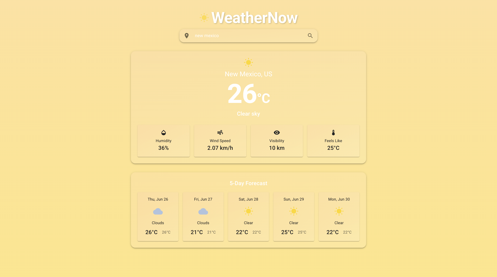
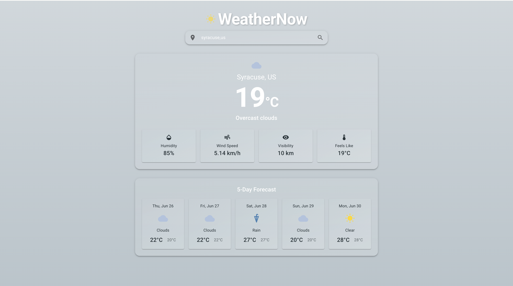

# WeatherNow Dashboard

A modern, responsive weather application built with React, TypeScript, and Material UI that provides real-time weather information for any city worldwide.

## Screenshots

Here are screenshots of the application with its dynamic theming:




## Features

- **City Weather Search**: Search for weather data in any city worldwide
- **Current Weather Display**: View temperature, weather condition, humidity, wind speed, and visibility
- **5-Day Forecast**: See the weather forecast for the next 5 days
- **Dynamic Theming**: UI theme changes based on the current weather condition (sunny, cloudy, rainy, etc.)
- **Temperature Unit Toggle**: Switch between Celsius and Fahrenheit
- **Responsive Design**: Works on desktop, tablet, and mobile devices

## Technologies Used

- **React**: UI library with functional components and hooks
- **TypeScript**: For type safety and better developer experience
- **Material UI**: Component library for modern design
- **Axios**: For API requests to OpenWeatherMap
- **Context API**: For state management across components
- **Webpack**: For bundling and development server

## Getting Started

### Prerequisites

- Node.js (v14 or higher)
- npm or yarn
- OpenWeatherMap API key

### Installation

1. Clone the repository:
   ```
   git clone https://github.com/mishrapiyush30/weather-app.git
   cd weather-app
   ```

2. Install dependencies:
   ```
   npm install
   ```

3. Add your OpenWeatherMap API key:
   - Sign up for a free API key at [OpenWeatherMap](https://openweathermap.org/api)
   - Open `src/api/weatherApi.ts` and replace the API_KEY variable with your actual API key

4. Start the development server:
   ```
   npm start
   ```

5. Open [http://localhost:3000](http://localhost:3000) to view the app in your browser

### Building for Production

To create a production build:

```
npm run build
```

The build files will be in the `dist` directory.

## Project Structure

```
weather-app/
├── public/
│   └── index.html
├── src/
│   ├── api/
│   │   └── weatherApi.ts
│   ├── components/
│   │   ├── CurrentWeatherCard/
│   │   ├── ErrorMessage/
│   │   ├── ForecastGrid/
│   │   ├── Loader/
│   │   ├── Logo/
│   │   └── SearchBar/
│   ├── contexts/
│   │   └── WeatherContext.tsx
│   ├── hooks/
│   │   └── useWeather.ts
│   ├── themes/
│   │   └── theme.ts
│   ├── types/
│   │   └── weather.ts
│   ├── App.tsx
│   └── index.tsx
└── package.json
```

## Features in Detail

### Dynamic Theming

The application theme changes based on the current weather condition:
- **Clear/Sunny**: Bright yellow/orange theme
- **Cloudy**: Gray/blue theme
- **Rainy**: Blue theme
- **Snowy**: Light blue/white theme

### Weather Information

- **Current Weather**: Temperature, feels like, weather condition, humidity, wind speed, and visibility
- **5-Day Forecast**: Daily high/low temperatures and weather conditions

### Search Functionality

- Search for any city worldwide
- Error handling for invalid city names
- Loading states during API calls

## License

This project is licensed under the ISC License.

## Acknowledgements

- [OpenWeatherMap API](https://openweathermap.org/api) for weather data
- [Material UI](https://mui.com/) for the component library
- [React](https://reactjs.org/) for the UI library 